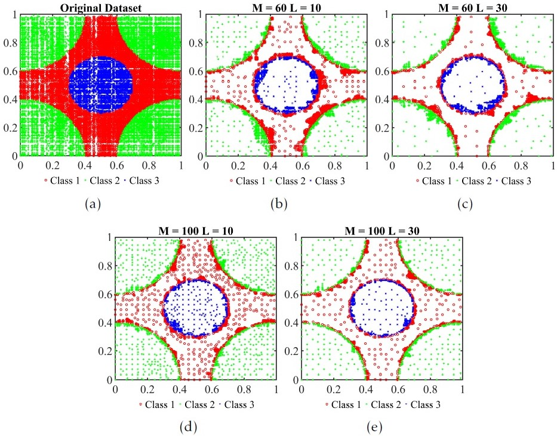

# BPLSH
A fast instance selection (Data reduction) for machine learning.

Training classifiers, especially Support Vector Machines (SVM), on large datasets is usually slow due to their high time complexities.
BPLSH addresses this limitation by selecting a small subset of the most representative training samples. BPLSH preserves instances that are near the decision boundaries and eliminates nonessential ones that are far from the decision boundaries.
The nearest patterns belonging to opposite classes of a given instance are regarded as border samples and are preserved, whereas instances that are far from opposite classes are considered as interior ones and are removed. The closeness of instances to a given sample is measured by the similarity index, which is defined based on partitioning the feature space.

# Implementation

The implementation is in MATLAB 2019. Significant effort has been taken to make BPLSH implementation as fast as possible. 

BPLSH_Example.m shows some simple examples of using BPLSH.  

# Citing

If you have used BPLSH in a scientific publication and wish to cite it, please use: 

M. Aslani, S. Seipel, Efficient and Decision Boundary Aware Instance Selection for Support Vector Machines, Information Sciences, 2021, ISSN 0020-0255.
https://doi.org/10.1016/j.ins.2021.07.015
